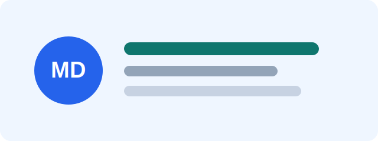

# Markdown Viewer 範例

這個頁面可以把本地 Markdown 檔案轉成 HTML 顯示。把 `docs` 資料夾拖進網站後，左側會列出可閱讀的文件。

## 支援內容

- 標題、段落與清單
- 粗體、斜體與連結
- 程式碼區塊
- 表格與引用
- 本地圖片
- 同一批匯入檔案中的 Markdown 連結

## 程式碼

```js
const message = "Hello Markdown";
console.log(message);
```

## 表格

| 項目 | 狀態 |
| --- | --- |
| Markdown render | 完成 |
| GitHub Pages | 可部署 |

> 把其他 `.md` 檔放進 repo，再用路徑載入即可。

## 相對連結

[開啟第二份文件](guide.md)


